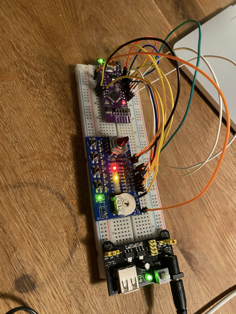

# Emil's Birthday Breadboard Project 🤓 🛰️ :electron:
25 Tolle Experimente mit Strom, Bits und Bytes

https://github.com/LMWB/LimbusZero/

## Inhalt
- Breadboard
- Netzteil
- Adapter für Spannungsversorgung (schwarz)
- LED mit Vorwiderstand
- BreadboardIO Platine (blau)
- LimbusZero Microcontroller Platine (lila)
- RGB-LED Ring
- RGB-LED Streifen
- Ein Satz Jumper Kabel verschiedener Länge
 
# Teil I: Spannungsversorgung
Schnapp dir das Breadbord (weisses plastik Brett mit vielen Löchern) und steck die Adapter Platine für das Netzteil drauf. Jetzt noch das dicke schwarze Netzteil an die Steckdose steck und mit der Adapterplatine verbinden, einschalten und schon hast du Saft auf der Mühle.

Bitte schau genau, dass die Polarität stimmt. Plus ist Rot und Minus ist blau.

# Teil II: Mein erstes Bauteil die LED
Jetzt kommt das erste elektronische Bauteil für dein erstes Experiment. Gemeint ist die kleine LED mit Widerstand angelötet. Schau was passiert wenn du sie auf das Powerrail steckst. Also ein Beinchen auf den Roten und das andere auf den Blauen Kontakt.
Passiert nix? Dann vertausche die Beinchen. 

Die Adapterplatine hat zwei kleine gelbe Brücken. Sie entscheiden ob 5V oder 3.3V Spannung auf dem Powerrail links bzw. recht anliegen. Versuch mal die Brücke abzuziehen und auf eine ander Position zu stecken.

Gibt es einen Unterschied? ______________________________

Woran könnte es liegen dass die LED leuchtet aber vertauscht man die Beinchen leutet sie nicht? ____________________________

# Teil III: Das breadboardIO Extension Board
{sprich: bräd bord Ei Oh und steht für Brotbrett Input Output}

Für die weiteren Versuche brauchst du die blaue Platinen mit den Knöpfen drauf.

## Aufstecken
Die Spannungsversorgung sollte jetzt auf beiden Sietenn auf 3V3 eingestellt sein.
Beim ersten mal aufstecken kann es sehr schwergängig sein. Bitte sei vorsichtig. Die goldenen Metallstifte (Pins) dürfen auf keinen Fall verbiegen.
Am Besten du holst dir Hilfe von einem Erwachsenen. 

Der doppelreihiger 3-fach Pin-Header muss auf das Power Rail. Wenn die grüne LED am breabboardIO leuchtet hast du es richtig gemacht, die Polarität stimmt!

## LED's
Die Spannungsversorgung sollte jetzt auf beiden Sietenn auf 3V3 eingestellt sein.
Verwende eines der beiligenden Jumper-Kabel und stecke das eine Ende auf das Power Rail ➕ Potential (rot). Mit dem anderen Ende kanst du der Reihe nach 
die mittleren 8 Pins abgreifen (leider habe ich vergessen diese zu beschriften J3 heisst die Stiftleiste).
Es sollte jeweils eine LED leuchten.

Welche Farben gibt es und wieviele? ____________________

Versuche es nocheinmal aber diesmal die Spannungsversorgung mit 5V eingestellt. kannst du einen Unterschied feststellen? _____________________

## Taster
Die Spannungsversorgung darf auf 3V3 oder 5V eingestellt sein.
Das bradbordIO hat 4 kleine schwarze Taster. Die Taster sind auf der Platine auf die oberen 4 Pins geführt, gekennzeichnet mit B1 bis B4 an der Stiftleiste J2.
Schnapp dir noch einmal das Jumper-Kabel von eben. Diesmal steckst du das eine Ende auf den Pin B1 und das andere auf eine beliebige LED. Dasnn drücke den Taster 1, der ganz oberer 👌

Probiere auch gern alle andere Taster. Es gibt noch einen fünften, der ist aber versteckt. Kannst du ihn finden?

Der fünfte Taster ist __________________________________________________

## Poti
Korrekterweise heisst das weisse flache Ding ganz oben Potenziometer aber das ist ein 💩-Wort, Poti klingt viel cooler.
Ein Poti ist ein drehbarer Spannungsteiler ... ach egal du wirst schon sehen was es macht.
Die Spannungsversorgung darf auf 3V3 oder 5V eingestellt sein. Wieder kommt das Jumper-Kabel zum Einsatz.
Das eine Ende steckst du auf den Pin mit der Beschriftung Poit (jaaa ich weiss ich habe mich verschrieben 🙈) das andere darf auf eine beliebige LED.
Jetzt brauchst du einen kleinen Schraubendreher und drehst das Poti hin und her.

Was passiert mit der LED? _________________________

Versuche gern auch eine andere Farbe. Fällt dir was auf? __________________________

Stell die Spannungsversorgung nun auf eine ander Position. Was passiert jetzt? ________________________

## Puls Drehgeber
Ganz unten auf der blauen Platine ist noch ein Drehnuppsi. Und wieder, du ahnst es, brauchen wir ein Jumper Kabel. Das steckst du mit der einen Seite .... *schon wieder auf eine LED voll langweilig* ja genau aber warts ab!

Das andere Ende steckst du bitte auf den dritten Pin von unten, also der vor-vor-letzte. Jetzt am Nuppsi drehen und ganz genau beobachten was passiert ___________________________________________

# Teil IV: LimbusZero Micrcontroller Board
Für die nun anstehende Versuchsreihe, brauchst du das BreadboardIO und die lilane Controller Platine. Das LimbusZero-Board ist dein neuer mini Computer 💻, ein so genannter Microcontroller.
Diese kleinen, cleveren, elektronischen Bauteile sind heutzutage fast überall verbaut. Man kann lustige Sachen mit ihnen machen wie du gleich fstestellen wirst.

Aber fangen wir von Vorne an. Zu ersteinmal benötigt der mini Cumputer Säääääft 😄 

## Spannungsversorgung
Platziere das LimbusZero Board irgendwo mittig auf dem Breadbord. Die Adapterplatine ist sicher noch angesteckt. Das linke Power-Rail bekommt 5V. Das rechte Power-Rail, auf dem das BreadbordIO steckt, bekommt 3V3. Jetzt verbindest du + (rot) mit dem Vin-Pin und - (blau) mit GND-Pin. Am besten du verwendest hier auch ein rotes und ein blaues Jumper Kabel. Hast du alles richtig gemacht leuchte eine grüne LED und der Herzschlag beginnt :heart_eyes: :heartbeat: 

## Heartbeet
{sprich Hart Biet es bedeutet Herzschlag}

Der LimbusZero hat eine rote LED und einen Heartbeat einprogrammiert, damit du weisst dass er läuft 🏃 auch wenn noch nix angeschlossen ist.

## Betriebsmodi
Der LimbusZero hat 6 Betriebsmodi. Lass sie uns herausfinde. Doch zuerst muessen wir noch ein paar Strippen ziehen. 
- Verbinde den Taster 1 mit dem B1-Pin.
- Verbinde das Poti mit dem P-Pin
- Verbinde den vor-vor-letzten Pin mit dem IncA-Pin
- Verbinde den vor-letzten Pin mit dem IncB-Pin

- Verbind alle LED-Pins mit den 01 bis 09-Pins
- bitte in korrekter Reihenfolge
- LED1 -> 01
- LED2 -> 02
- ...
- LED8 -> 08
Puh das war anstrengend. Aber die Mühe hat sich gelohnt. Jetzt können wir (fast) alles teste. Es sollte jetzt so ungefähr so bei dir aussehen.

Die 6 Modie heissen:
- eINCREMENT
- eGAUGE
- eKNIGHTRIDER
- eSNAKE
- eLASTBLINK
- eNEOPIXEL

Wenn du jetzt den Taster 1 drückst wechselt der LimbusZero seine Betriebsmodi. Jeder Modus hat ein spannendes Feature dass du entweder mit dem Poti oder mit dem Drehnuppsi einstellen kannst.

### Modus: Incremet
Mit dem Drehnuppsi kannst du binär von 0 bis 255 zählen. 

### Modus: Gauge (Tachometer)
Schraubendrehe und Poti lassen die LEDs tanzen

### Modus: Knightrider
Kein Kommentar, wir alle kennen Kit! Aber der Drehnuppsi hat bstimmt auch was damit zu tun :sunglasses:

### Modus: Snake
Siehe Knightrider.

### Modus: Lastblink
Das letzte Muster der Schneckenspuhr wechselt ins negative hin und her.

### Modus: NeoPixel
Dafür brauchen wir ein extra Kapitel.

## RGB LED 
RGB steht fuer Rot, Gruen, Blau. Schau dir den Ring einmal genu an. Es sind 12 LED verloetet und jed dieser LEDs hat drei Farben die wir einzeln ansteuern koenne. Das coole dabei ist, man kann die Farben auch mischen und kann so jede Farbe der Welt selber zusammenbasteln.

Um mit der Zaubere starten zu koennen, muessen wir ein letzten Mal Kabel ziehen aber vorher Spannung ausschalten bitte!

- Verbinde den Taster 2 mit dem B2-Pin
- Verbinde den Taster 3 mit dem B3-Pin
- Verbinde den Taster 4 mit dem B4-Pin

Ausserdem muss natuerlich der LED Ring noch angestoepselt werden. Der Ring hat drei Kabel angeloetet. Rot und Blau muss auf das Powerrail (ist egal ob 5V Seite oder 3.3V Seite). Das gelbe Kabel ist die Datenleitung und die muss auf den LimbusZero D-Pin.

Dann die Spannung wieder einschalten und 5x auf den Taster 1 druecken (damit navigieren wir in den Modus 6). Hast du alles richtig verkabelt sollte der LED ring leuchten in einer der RGB-Farben. Mit den Taster 2,3 und vier kannst du die Farbe aendern und mit dem Drehnubbsi kannst du die Helligkeit der gerade angewaehlten Farbe anpassen. Wenn du zum Beispiel Rot ausgewaehlt hast und nochmal auf den Rot-Knopf drueckst, erhaeltst du das Mischergebnis! Versuch mal Gelb herzustellen!

Gelb mischt man mit der Einstellung ____________________________________________

## RGB LED Streifen
siehe RGB LED
